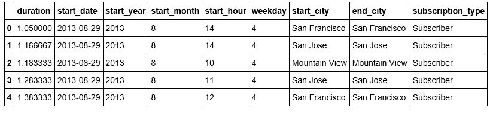
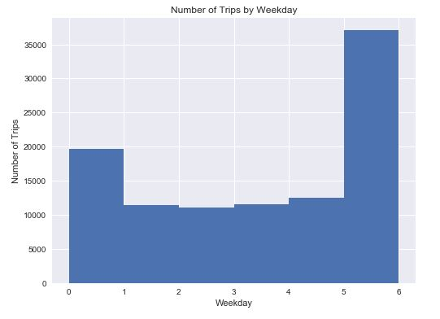
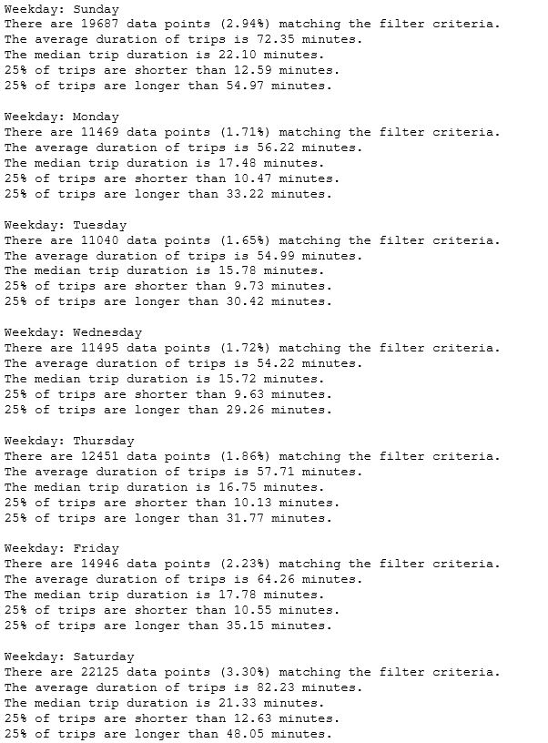

## Bay Area Bike Share Analysis 
Language: Python(pandas, NumPy, Matplotlib)   
Skills: Data exploration, Data visualization  
Use tables and histograms to explore and visualize the Bay Area Bike Share data. 

  

  

  

